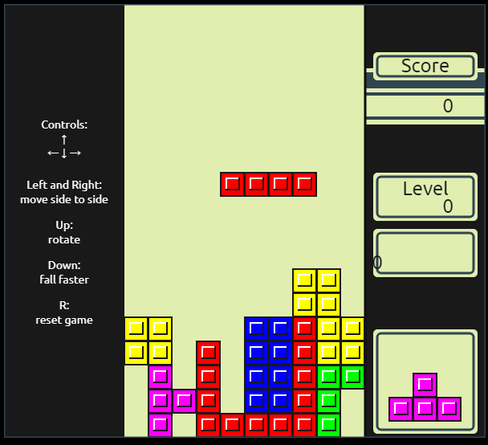

# 🎮 Tetris - Juego de Mesa

Una versión de **Tetris** llevada al mundo físico, rediseñada para ser **más desafiante** y **divertida**.  
Inspirado en el clásico de 1984 creado por **Alexey Pajitnov**, adaptado como un juego de mesa moderno.

---

## 📋 Descripción

Tetris nació en 1984 como un videojuego, pero esta versión reimagina su esencia en forma de **juego de mesa**.  
El objetivo sigue siendo el mismo: **completar líneas** de 10 piezas. ¡Pero con nuevas reglas que aumentan el reto!

---

## 🚀 Características

- 🎲 **Versión de mesa** del clásico Tetris.
- 🎨 **Personalizable**: puedes adaptar reglas y estilos.
- 🧠 **Fácil de aprender** pero difícil de dominar.

---

## 🖼️ Capturas

|  |  |  |
|:--:|:--:|:--:|

---

## 🤝 Cómo Contribuir

¡Toda ayuda es bienvenida! Si quieres mejorar este proyecto, sigue estos pasos:

1. **Haz un fork** del repositorio.
2. **Crea una nueva rama** (`git checkout -b feature-nueva`).
3. **Realiza tus cambios** y haz commit (`git commit -m "Agrega nueva feature"`).
4. **Envía un Pull Request**.

---
